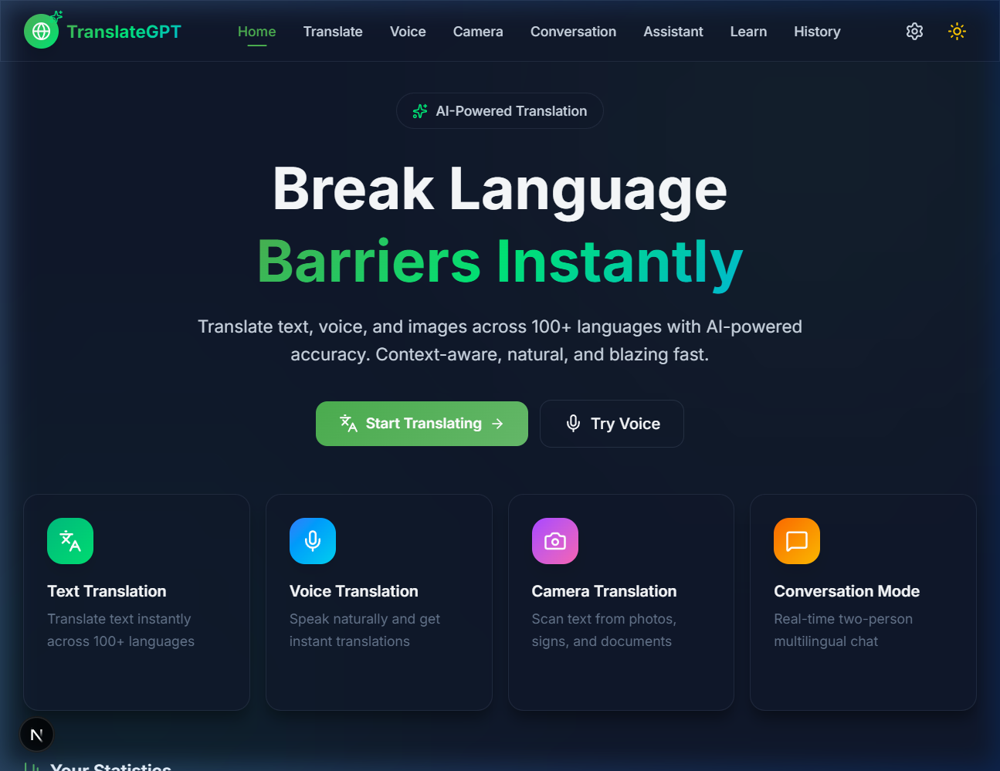
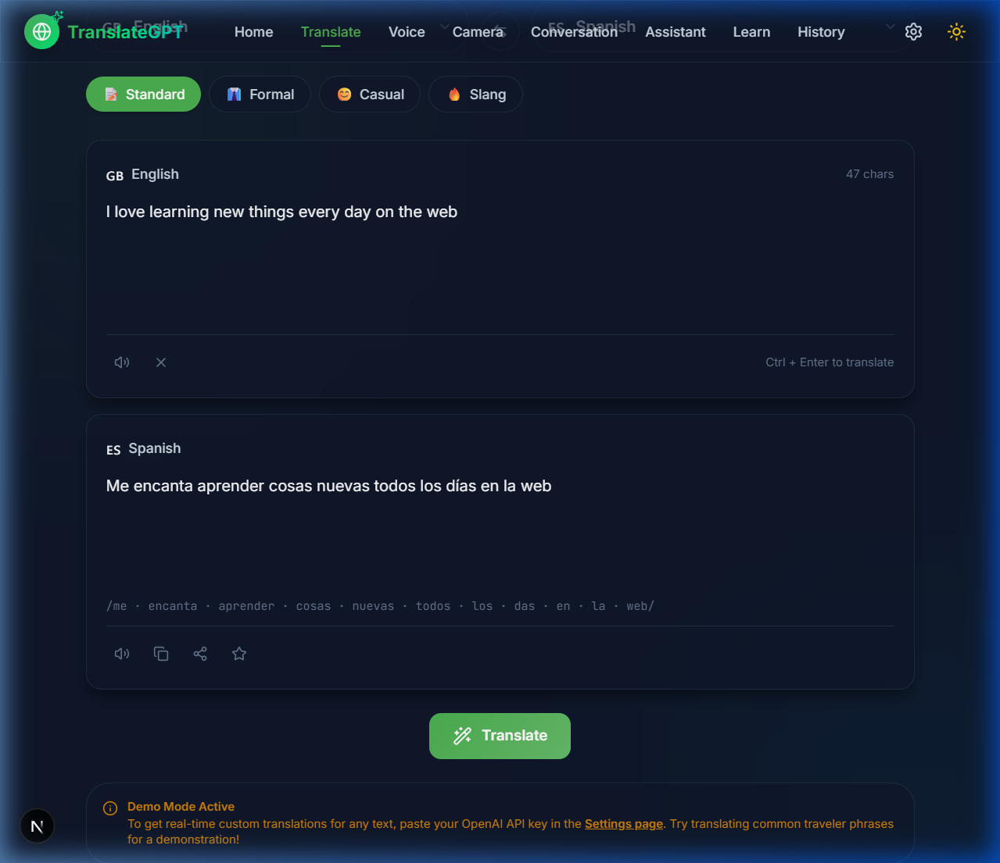
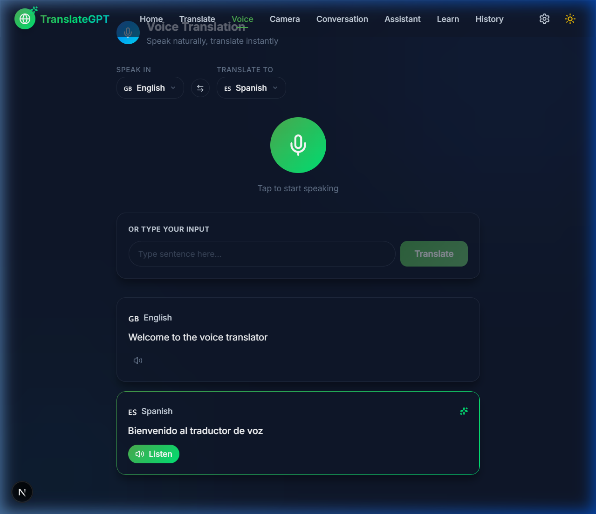
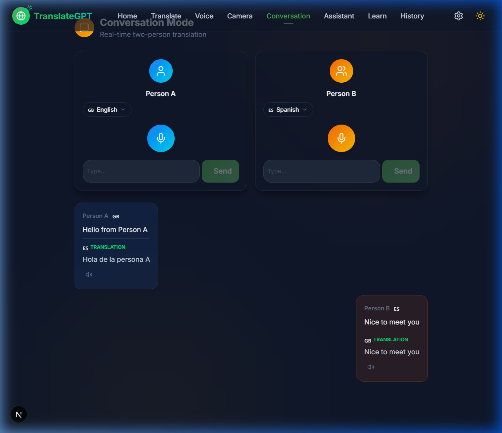
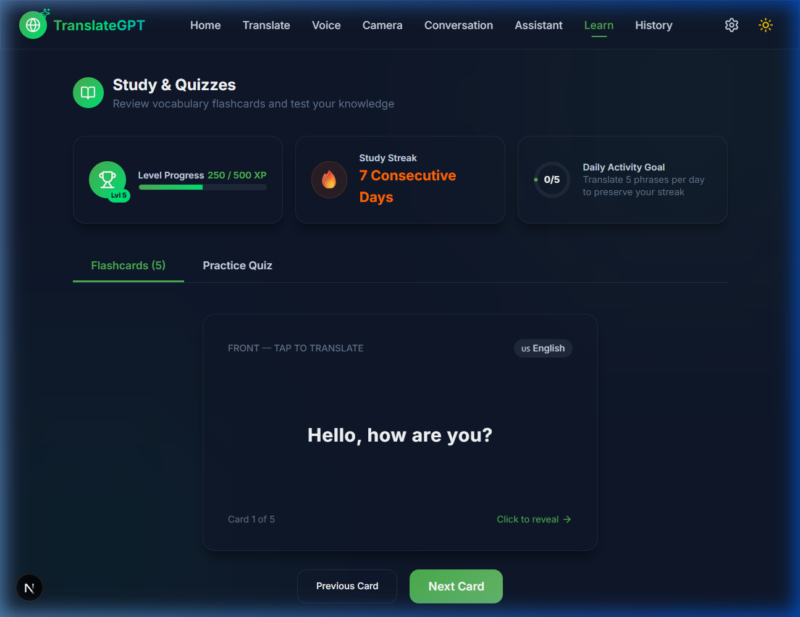
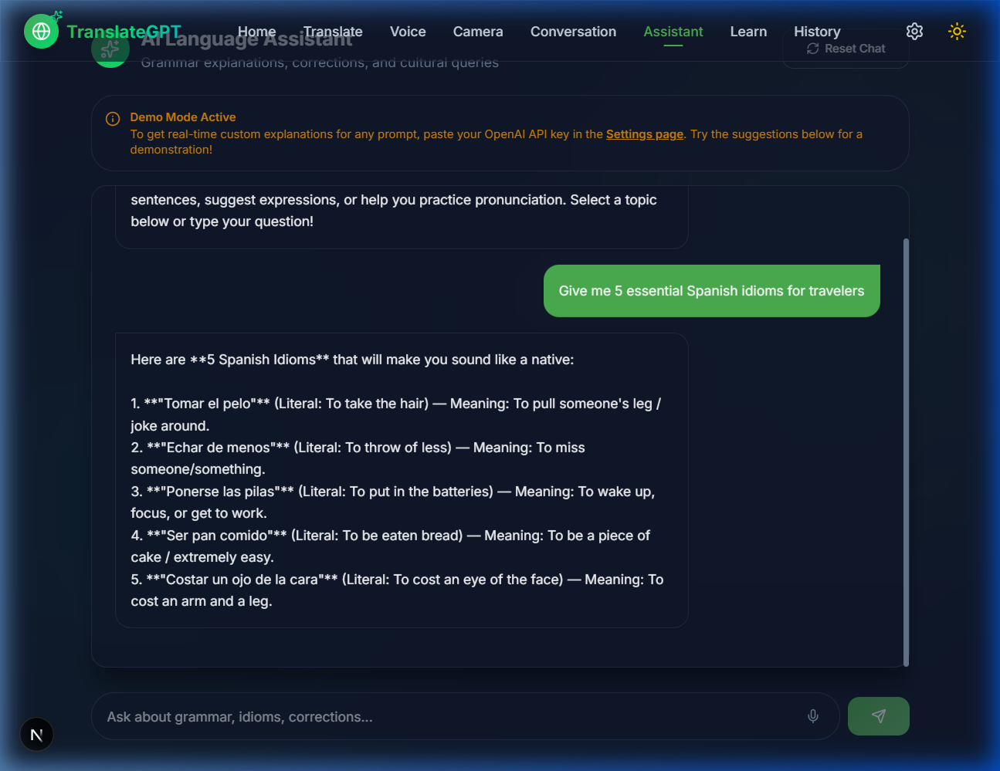

# 🌍 TranslateGPT — AI-Powered Multilingual Translator

TranslateGPT is a premium, mobile-first translation and language-learning application. Designed with modern **Glassmorphic SaaS aesthetics**, the platform offers instant translations across text, voice, camera, and live conversations. It also includes a fully gamified learning dashboard featuring daily translation progress trackers, 3D flippable flashcards, streak mechanics, XP levels, and an interactive AI Language Assistant.

---

## 📸 Screen Previews

| Dashboard & Stats | Text Translation |
|:---:|:---:|
|  |  |

| Voice Mode | Live Conversation |
|:---:|:---:|
|  |  |

| Gamified Learn Hub | AI Language Assistant |
|:---:|:---:|
|  |  |

---

## ✨ Core Features

* ⚡ **Text Translation**: Translate custom text between 100+ languages. Supports standard, formal, or casual tones, text-to-speech audio playback, and copy-to-clipboard functionality. Powered by user-configured OpenAI models with a dynamic free fallback to the **MyMemory API**.
* 🎙️ **Voice Translation**: Real-time microphone capture utilizing the browser's native **Web Speech API** paired with a responsive sound wave animation. Includes proactive permission check prompts, missing hardware indicators, and a clean keyboard input fallback.
* 👥 **Conversation Mode**: A split-screen interface designed for two-person, bilingual chats. Features auto-played text-to-speech (TTS) translations, individual speaker panels, and keyboard inputs for noise-restricted zones.
* 📷 **Camera / OCR Translation**: Drag-and-drop or upload images containing text. The local **Tesseract.js** engine extracts the text client-side for immediate translation, avoiding backend payload transfers.
* 🔒 **Secure Authentication & Onboarding**: Complete client-side profile registry supporting Email/Password sign-up, secure login, password reset, and simulated Google/Apple OAuth overlays. Includes personalized onboarding to capture native language, learning goals (Travel, Business, School, Fluency, Casual), and target languages.
* 📊 **Personalized Activity Dashboard**: Logged-in users receive a tailored hub showing daily XP goal rings, consecutive learning streaks, a weekly activity bar chart, favorite expressions list, and current learning statistics.
* 📁 **Saved Library & Folder Management**: Create custom folders (e.g. "Travel Spanish") and assign saved translations, voice logs, or conversation snapshots using handy interactive dropdowns. Support for language filtering and real-time query filtering.
* 🗺️ **Dynamic Learning Path**: Custom learning paths with units, interactive lessons, review milestones, and goal-specific AI booster modules (e.g. "Fluency Boosters", "Travel Phrasebooks").
* 🧠 **AI Tutor with Memory**: Dedicated AI Tutor page that saves chat logs to the user's isolated profile memory, tailoring grammar exercises, sentence builders, and feedback to the user's specific targets and goals.
* 🔍 **Global Intelligent Search**: Locate information instantly with a global search query engine mapping across saved translation history, custom folders, vocabulary lists, and AI Tutor logs.
* 🎓 **Gamified Study Center**:
  * **Interactive Quiz**: Dynamically checks vocabulary with a 5-question multi-choice exam, awarding **+50 XP** on a successful score.
  * **3D Flippable Flashcards**: Automatically populated from your favorited translation logs. Flip them with fluid Framer Motion animations and mark them as "Mastered" or "Needs Practice".
  * **Streak & Level Systems**: Tracks consecutive study days and increments user level (Level = `floor(XP / 500) + 1`).
* 🤖 **AI Language Assistant**: Interactive AI assistant for grammar explanations, pronunciation guides, and German case structures. Supported by dynamic typewriter animations and suggestions.
* ⚙️ **Robust Settings**: Configure your personal OpenAI API Key, toggle text-to-speech voice speed (0.75x to 1.5x), unlock system badges, download logs as JSON, or clear history storage in a single tap.

---

## 🎨 UI & Design Aesthetics

* **Glassmorphism**: Elegant transparency utilizing custom backdrop-blur backings, thin light-refracting borders, and smooth shadows.
* **Curated Color Palette**:
  * *Primary Color*: `#4CAF50` (Vibrant emerald green)
  * *Secondary Color*: `#8BC34A` (Soft light green)
  * *Accent Color*: `#00E676` (Neon green accents)
  * *Background Dark*: `#0F172A` (Sleek slate background)
  * *Background Light*: `#F8FAFC` (Clean slate-white backdrop)
* **Ambience Effects**: Layered, animated radial light blobs that transition between Cyan, Blue, Amber, and Orange gradients depending on the selected feature.
* **Micro-Animations**: Hover-scaling indicators, flip state rotations, and page transition fades driven by Framer Motion.

---

## 🛠️ Technology Stack

* **Framework**: Next.js 15 (Turbopack, App Router)
* **Core Logic**: React 19, TypeScript
* **Styling**: Tailwind CSS v4, PostCSS, Custom Vanilla CSS utilities
* **State Management**: Zustand (with localStorage persistence)
* **Speech Integration**: Web Speech API (`SpeechRecognition` & `SpeechSynthesisUtterance`)
* **OCR Processor**: Tesseract.js (Client-side WASM compilation)
* **Animations**: Framer Motion 12
* **Icons**: Lucide React

---

## ⚙️ Installation & Local Setup

### Prerequisites
* [Node.js](https://nodejs.org/) (v18.0.0 or higher recommended)
* NPM or Yarn package manager

### 1. Clone the Repository
```bash
git clone https://github.com/shrutiyadav062106-ui/TranslateGPT.git
cd TranslateGPT/translategpt
```

### 2. Install Dependencies
```bash
npm install
```

### 3. Configure the Environment
Create a `.env` or `.env.local` file in the project's root folder:
```env
# Optional: Add default API keys here if you do not want to use Settings configuration
NEXT_PUBLIC_DEFAULT_OPENAI_KEY=your-openai-api-key-here
```
*Note: If no API key is specified, TranslateGPT automatically degrades gracefully to use high-quality local mock translation models (which splits and parses compound sentences) and the free MyMemory translation API fallback so the app remains fully functional.*

### 4. Run the Development Server
```bash
npm run dev
```
Open [http://localhost:3000](http://localhost:3000) in your web browser.

### 5. Build for Production
To compile and check for type safety:
```bash
npm run build
```

---

## 📜 License
Distributed under the MIT License. See `LICENSE` for more information.
